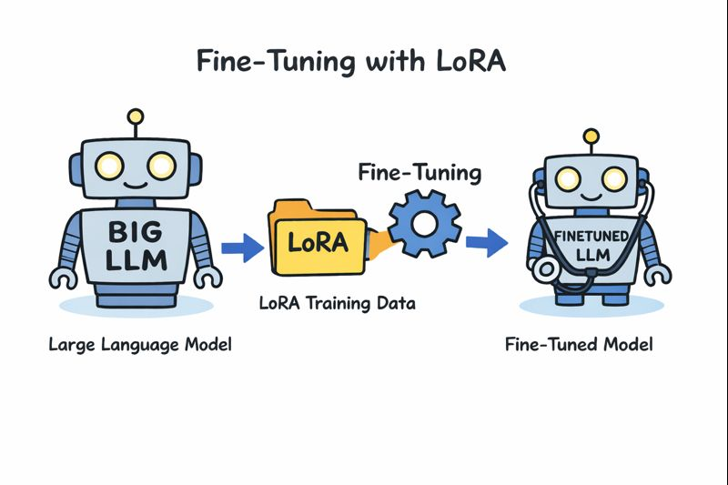

# LLM Fine-Tuning Pipeline for Healthcare



A medical language model fine-tuning system using LoRA (Low-Rank Adaptation) for efficient training on consumer GPUs. Fine-tune large language models like Microsoft Phi-4-mini-instruct or SmolLM variants for medical question-answering tasks with built-in safety features.

## What This Does

- **Fine-tunes medical AI models** using your own medical Q&A dataset
- **Memory efficient** training with 4-bit quantization and LoRA adapters
- **Interactive inference** to chat with your trained medical assistant
- **Built-in safety features** with medical-specific system prompts and safety responses
- **Multiple model support** including Phi-4-mini-instruct and SmolLM variants
- **Automatic model saving** with numbered checkpoints for easy model management

## Example inference output

[Click here](assets/output_log.md) to see an example of the performance of the model on new questions.

## Prerequisites

- NVIDIA GPU with at least 6GB RAM
  - I used a Microsoft Surface Laptop Studio 2 with an NVIDIA RTX 2000 Ada and WSL2.
- [Pixi](https://pixi.sh) package manager
- Medical training data in JSONL format

## Installation

1. Clone this repository
2. Install Pixi from [pixi.sh](https://pixi.sh)
3. Navigate to the project directory

## Usage

### Training a Model

```bash
pixi run python main.py train
```

This will:
- Load your training data from `data/my_custom_data.jsonl`
- Fine-tune the selected model using LoRA
- Save training checkpoints to `./checkpoints/model/checkpoint-{step}/`
- Create a final model directory like `./checkpoints/model/my_custom_llm_{model_name}/`

### Using the Trained Model

```bash
pixi run python main.py inference
```

This starts an interactive medical AI assistant where you can ask questions.

### Custom Configuration

Use a different config file:
```bash
pixi run python main.py train my_config.yaml
```

## Data Format

Your training data should be in JSONL format with medical instruction-response pairs:

```json
{"instruction": "What are the symptoms of diabetes?", "response": "Common symptoms include increased thirst, frequent urination, unexplained weight loss, fatigue, and blurred vision."}
{"instruction": "How do you treat hypertension?", "response": "Treatment typically involves lifestyle changes (diet, exercise) and may include medications like ACE inhibitors or diuretics."}
```

Place your data file at `data/my_custom_data.jsonl`.

## Configuration Options

Edit `config.yaml` to customize training:

```yaml
# Global settings
seed: 816
output_dir: ./checkpoints/model

# Model settings
model:
  name: microsoft/Phi-4-mini-instruct  # or HuggingFaceTB/SmolLM-135M-Instruct
  max_length: 512                      # Maximum sequence length

# LoRA adapter settings
lora:
  r: 16                               # LoRA rank (higher = more parameters)
  alpha: 32                           # LoRA scaling factor
  dropout: 0.1                        # Dropout rate
  target_modules: [q_proj, v_proj, k_proj, o_proj]

# Training settings
training:
  batch_size: 4                       # Batch size per GPU
  max_steps: 36                       # Maximum training steps
  learning_rate: 2e-4                 # Learning rate
  gradient_accumulation_steps: 8      # Gradient accumulation
  early_stopping_patience: 3          # Early stopping patience

# Data settings with safety prompt
data:
  train_file: ./data/my_custom_data.jsonl
  system_prompt: >
    You are a careful medical assistant providing evidence-based information...
```

### Quick Setup Presets

For **fast testing** (fewer steps, small batch):
```yaml
training:
  max_steps: 10
  batch_size: 1
  gradient_accumulation_steps: 4
```

For **production training** (more steps, better results):
```yaml
training:
  max_steps: 100
  learning_rate: 1e-4
  early_stopping_patience: 5
```

## Safety Features

- **Medical System Prompt**: Built-in prompt that guides the model to provide safe, evidence-based responses
- **Safety Responses**: Model trained to respond with "I don't have enough information to answer this safely" for potentially dangerous queries
- **Educational Disclaimers**: Automatic reminders that responses are for educational purposes only
- **Harm Prevention**: Model refuses to provide specific diagnoses or potentially harmful advice

## Technical Details

- **LoRA (Low-Rank Adaptation)**: Efficiently fine-tunes only a small number of parameters
- **4-bit Quantization**: Reduces memory usage for training on consumer GPUs  
- **Early Stopping**: Automatically stops training when the model stops improving
- **Gradient Checkpointing**: Further reduces memory usage during training
- **Chat Template**: Formats conversations for instruction-following models
- **Multiple Model Support**: Works with Phi-4-mini-instruct, SmolLM variants, and other compatible models

## System Requirements

- **GPU**: NVIDIA GPU with 6GB+ RAM (RTX 3060, RTX 4060, or better)
- **RAM**: 16GB+ system RAM recommended
- **Storage**: 10GB+ free space for model weights and checkpoints
- **OS**: Linux, macOS, or Windows with WSL2

## File Structure

```
medical-llm-pipeline/
├── main.py                   # Main training and inference script
├── config.yaml               # Configuration settings
├── utils.py                  # Core training and inference utilities
├── pixi.toml                 # Pixi package management
├── data/my_custom_data.jsonl # Your medical training data
└── checkpoints/              # Saved model adapters
    └── model/
        ├── checkpoint-9/     # Training checkpoint at step 9
        ├── checkpoint-20/    # Training checkpoint at step 20
        ├── checkpoint-36/    # Final training checkpoint
        └── my_custom_llm_Phi-4-mini-instruct/  # Final model adapter
```

## Example Usage

### Training Output
```bash
$ pixi run python main.py train
🚀 Starting training...
📁 Loading data from ./data/my_custom_data.jsonl
🔄 Setting up microsoft/Phi-4-mini-instruct model
💾 Training checkpoint saved to ./checkpoints/model/checkpoint-20/
✅ Training completed! Final model saved to ./checkpoints/model/my_custom_llm_Phi-4-mini-instruct/
```

### Inference Examples
```bash
$ pixi run python main.py inference
Medical AI Assistant - Type 'quit' to exit

Ask me a question: What are the symptoms of diabetes?
🎯 Response: Common symptoms of diabetes include increased thirst, frequent urination, 
unexplained weight loss, fatigue, and blurred vision. This response was generated 
by AI. It is for educational purposes only and should not replace professional 
medical advice. Please consult with qualified healthcare practitioners for medical decisions.

Ask me a question: How do I perform surgery?
🎯 Response: I don't have enough information to answer this safely. Please consult a healthcare professional.
```

## Troubleshooting

**Out of Memory Error**: Reduce `batch_size` to 1 or `max_length` to 256 in config.yaml

**Training Too Slow**: Increase `batch_size` if you have more GPU memory

**Poor Results**: Increase `max_steps` or check your training data quality

**Model Too Conservative**: Adjust the `system_prompt` in config.yaml to be less restrictive

**Checkpoint Not Found**: Check that training completed successfully and look in `./checkpoints/model/` for available checkpoints