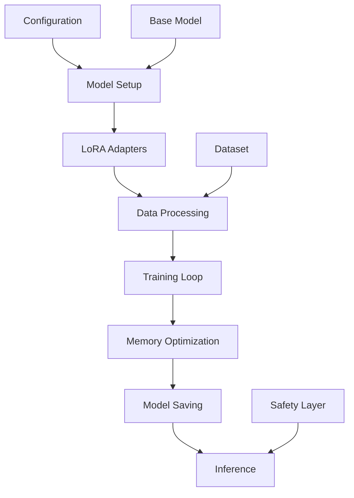

# Architecture Overview

This document provides a comprehensive overview of the LoRA fine-tuning architecture, explaining how all components work together to create an efficient and effective training pipeline for medical AI applications.

## 🏗️ System Architecture

The LoRA fine-tuning system is built on a modular architecture that separates concerns and enables efficient parameter-efficient training:



## 🔧 Core Components

### 1. Configuration Management

- **Purpose**: Central configuration for all training parameters
- **Location**: `config.yaml`
- **Features**: Model selection, training hyperparameters, safety settings
- **Benefits**: Reproducible experiments, easy parameter tuning

### 2. Model Setup and Loading

- **Purpose**: Initialize the base model and tokenizer
- **Features**: 4-bit quantization, device mapping, attention implementation
- **Memory Optimization**: BitsAndBytes integration for reduced VRAM usage
- **Compatibility**: Support for various Hugging Face model architectures

### 3. LoRA Implementation

- **Purpose**: Add trainable adapter layers to frozen base model
- **Technique**: Low-rank matrix decomposition
- **Parameters**: Rank (r), alpha scaling, dropout, target modules
- **Efficiency**: <1% of original model parameters remain trainable

### 4. Data Processing Pipeline

- **Purpose**: Transform raw datasets into model-compatible format
- **Features**: JSONL parsing, tokenization, prompt templating
- **Safety**: Content filtering and validation
- **Batching**: Dynamic batching for memory efficiency

## 💡 Design Principles

### Parameter Efficiency

The architecture prioritizes memory efficiency through several mechanisms:

- **Frozen Base Model**: Only LoRA adapters are trainable
- **4-bit Quantization**: Reduces model size by ~75%
- **Gradient Checkpointing**: Trades computation for memory
- **Dynamic Batching**: Optimizes batch sizes for available memory

### Modularity

Each component is designed to be independently configurable:

- **Swappable Base Models**: Easy to change underlying model
- **Configurable LoRA Parameters**: Tune rank and target modules
- **Pluggable Data Sources**: Support multiple dataset formats
- **Flexible Training Schedules**: Custom learning rate schedules

### Safety Integration

Safety considerations are built into every layer:

- **System Prompts**: Medical safety guidelines embedded
- **Content Filtering**: Automatic detection of harmful content
- **Professional Boundaries**: Clear limitations and referrals
- **Audit Trails**: Comprehensive logging for accountability

## 🔄 Data Flow

### Training Data Flow

1. **Dataset Loading**: JSONL files parsed into conversation format
2. **Tokenization**: Text converted to model-compatible tokens
3. **Prompt Templating**: System prompts and formatting applied
4. **Batching**: Dynamic batching based on sequence length
5. **Forward Pass**: Base model + LoRA adapters process input
6. **Loss Computation**: Compare predictions to target tokens
7. **Backward Pass**: Gradients computed only for LoRA parameters
8. **Parameter Updates**: LoRA weights updated via optimizer

### Inference Data Flow

1. **Input Processing**: User query tokenized and formatted
2. **Context Assembly**: System prompts and safety guidelines added
3. **Model Forward**: Base model + LoRA adapters generate response
4. **Safety Filtering**: Output checked against safety guidelines
5. **Response Formatting**: Clean, professional medical response

## 🧠 Memory Management

### Training Memory Layout

```text
GPU Memory Allocation:
├── Base Model (frozen, 4-bit quantized)     ~3.5GB
├── LoRA Adapters (trainable)               ~50MB
├── Optimizer States                        ~100MB
├── Gradients                               ~50MB
├── Activation Cache                        ~1-2GB
└── Batch Data                              ~500MB-1GB
Total: ~6-7GB for Phi-4-mini
```

### Memory Optimization Strategies

- **Gradient Checkpointing**: Recompute activations instead of storing
- **Mixed Precision**: Use FP16 for forward pass, FP32 for gradients
- **Dynamic Batching**: Adjust batch size based on sequence length
- **Offloading**: Move unused parameters to CPU memory when needed

## 🎛️ Configuration Hierarchy

The system uses a hierarchical configuration approach:

```yaml
# Global settings affect entire system
global:
  device: "cuda"
  precision: "fp16"

# Model-specific settings
model:
  base_model: "microsoft/Phi-4-mini-instruct"
  quantization: "4bit"

# LoRA-specific settings
lora:
  rank: 32
  alpha: 64
  dropout: 0.1

# Training-specific settings
training:
  learning_rate: 1e-4
  batch_size: 2
  max_steps: 1000
```

## 🔗 Integration Points

### External Dependencies

- **Transformers**: Model loading and tokenization
- **PEFT**: LoRA implementation and management
- **BitsAndBytes**: Quantization and memory optimization
- **PyTorch**: Core deep learning framework
- **Datasets**: Data loading and processing

### Internal Modules

- **utils.py**: Helper functions and utilities
- **main.py**: Training orchestration and CLI interface
- **config.yaml**: Configuration management
- **Data pipeline**: Custom dataset processing

## 🎯 Performance Characteristics

### Training Performance

- **Speed**: ~100 tokens/second on RTX 4090
- **Memory**: 6-7GB VRAM for full training
- **Convergence**: Typically 500-1000 steps for medical fine-tuning
- **Stability**: Gradient clipping prevents training instabilities

### Inference Performance

- **Latency**: ~50ms per token generation
- **Throughput**: ~20 tokens/second sustained
- **Memory**: ~4GB VRAM for inference only
- **Quality**: Maintains base model performance with domain adaptation

## 🔮 Future Extensibility

The architecture is designed for future enhancements:

### Planned Features

- **Multi-GPU Training**: Distributed training support
- **Dynamic LoRA Rank**: Adaptive rank selection during training
- **Knowledge Distillation**: Compress knowledge from larger models
- **Active Learning**: Intelligent data selection for continuous learning

### Extension Points

- **Custom Adapters**: Support for other parameter-efficient methods
- **Model Variants**: Easy integration of new base models
- **Safety Modules**: Pluggable safety and content filtering
- **Evaluation Metrics**: Comprehensive model assessment tools

This architecture provides a solid foundation for medical AI applications while maintaining the flexibility to adapt to new requirements and technologies.
