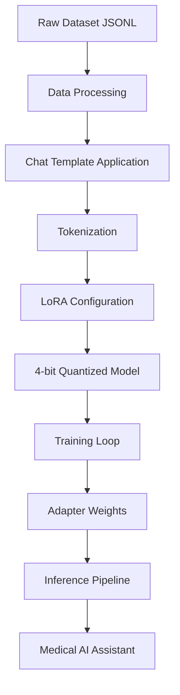

# LoRA Fine-Tuning Guide

Welcome to the comprehensive guide for **LoRA (Low-Rank Adaptation)** fine-tuning of large language models.
This documentation covers everything from basic concepts to advanced implementation techniques for
parameter-efficient fine-tuning.

!!! danger "Educational use only"
    This project is intended for **educational purposes only**.
    It should **not** be construed as healthcare advice.

## 🎯 What You'll Learn

- **LoRA Theory**: Understanding the mathematics and principles behind parameter-efficient fine-tuning
- **Dataset Creation**: How to create and format training datasets using simple text editors
- **Implementation**: Step-by-step code walkthrough of a complete fine-tuning pipeline
- **Safety & Ethics**: How Microsoft's Phi-4 models implement responsible AI principles

## 🚀 Quick Start

!!! info "Prerequisites"
    - NVIDIA GPU with ≥8GB VRAM
    - Python 3.11+ environment
    - Basic understanding of machine learning concepts

1. **[Understand LoRA](getting-started/what-is-lora.md)** - Learn the fundamentals
2. **[Check Prerequisites](getting-started/prerequisites.md)** - Ensure you have everything needed
3. **[Create Your Dataset](dataset/creating-dataset.md)** - Prepare training data
4. **[Start Training](training/training-loop.md)** - Begin fine-tuning your model

## 🔬 Key Features

- **Memory Efficient**: Train large models with consumer GPUs using 4-bit quantization
- **Fast Training**: LoRA adapters train in minutes instead of hours
- **Safety First**: Built-in medical AI safety guidelines and ethical considerations
- **Modular Design**: Swap adapters without retraining the base model
- **Production Ready**: Complete pipeline from training to deployment

## 🏥 Medical AI Focus

This guide specifically addresses the unique challenges of medical AI applications:

- **Safety Protocols**: Preventing harmful medical advice
- **Professional Boundaries**: Appropriate deferral to healthcare professionals
- **Regulatory Compliance**: FDA and WHO guidelines for AI in healthcare
- **Ethical Training**: Microsoft's responsible AI principles in practice

## 🛡️ Built on Microsoft Phi-4

This implementation leverages Microsoft's Phi-4-mini-instruct model, specifically designed with:

- Constitutional AI training for safety
- Built-in content filters and boundary respect
- Extensive red team testing for robustness
- Alignment with responsible AI principles

## 🏗️ Architecture Overview

---

Ready to start? Begin with **[What is LoRA?](getting-started/what-is-lora.md)** to understand the fundamentals.
