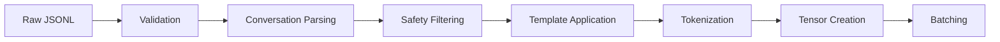

# Data Processing Pipeline

This document describes the comprehensive data processing pipeline for preparing medical AI training data, from raw JSONL files to model-ready tensors with proper safety validation and formatting.

## 🔄 Processing Overview

The data processing pipeline transforms raw conversation data into tokenized, formatted inputs suitable for LoRA fine-tuning while maintaining medical safety standards.



## 📁 Dataset Format Requirements

### Input JSONL Structure

```json
{
  "id": "medical_qa_001",
  "messages": [
    {
      "role": "system",
      "content": "You are a helpful medical AI assistant..."
    },
    {
      "role": "user",
      "content": "What are the symptoms of diabetes?"
    },
    {
      "role": "assistant",
      "content": "Diabetes symptoms include frequent urination, excessive thirst..."
    }
  ],
  "metadata": {
    "topic": "endocrinology",
    "difficulty": "basic",
    "safety_checked": true
  }
}
```

### Required Fields

- **id**: Unique identifier for each conversation
- **messages**: List of conversation turns with role and content
- **metadata** (optional): Additional information for filtering and analysis

## 🔍 Data Validation

### Schema Validation

```python
import json
from typing import Dict, List, Any, Tuple
from jsonschema import validate, ValidationError

# JSON Schema for medical conversation data
CONVERSATION_SCHEMA = {
    "type": "object",
    "properties": {
        "id": {"type": "string"},
        "messages": {
            "type": "array",
            "minItems": 2,
            "items": {
                "type": "object",
                "properties": {
                    "role": {"type": "string", "enum": ["system", "user", "assistant"]},
                    "content": {"type": "string", "minLength": 1}
                },
                "required": ["role", "content"]
            }
        },
        "metadata": {"type": "object"}
    },
    "required": ["id", "messages"]
}

def validate_conversation(data: Dict[str, Any]) -> Tuple[bool, str]:
    """Validate a single conversation entry"""
    try:
        validate(instance=data, schema=CONVERSATION_SCHEMA)

        # Additional medical-specific validation
        messages = data["messages"]

        # Check for required system message
        if not any(msg["role"] == "system" for msg in messages):
            return False, "Missing system message"

        # Validate conversation flow
        roles = [msg["role"] for msg in messages]
        if not validate_conversation_flow(roles):
            return False, "Invalid conversation flow"

        # Check content length limits
        for msg in messages:
            if len(msg["content"]) > 4000:  # Reasonable limit
                return False, f"Message too long: {len(msg['content'])} chars"

        return True, "Valid"

    except ValidationError as e:
        return False, f"Schema validation error: {e.message}"

def validate_conversation_flow(roles: List[str]) -> bool:
    """Validate that conversation follows logical flow"""
    # Must start with system (optional) then user
    if roles[0] not in ["system", "user"]:
        return False

    # After system, must have user message
    if roles[0] == "system" and len(roles) > 1 and roles[1] != "user":
        return False

    # Must end with assistant response
    if roles[-1] != "assistant":
        return False

    return True
```

### Quality Checks

```python
def perform_quality_checks(conversation: Dict[str, Any]) -> List[str]:
    """Perform comprehensive quality checks on conversation"""
    issues = []
    messages = conversation["messages"]

    # Check for empty or very short responses
    for msg in messages:
        if len(msg["content"].strip()) < 10:
            issues.append(f"Very short {msg['role']} message")

    # Check for repetitive content
    contents = [msg["content"] for msg in messages]
    if len(set(contents)) != len(contents):
        issues.append("Duplicate messages detected")

    # Medical-specific checks
    assistant_msg = [msg for msg in messages if msg["role"] == "assistant"][-1]

    # Check for diagnostic claims
    diagnostic_keywords = ["you have", "you are diagnosed", "it is definitely"]
    if any(keyword in assistant_msg["content"].lower() for keyword in diagnostic_keywords):
        issues.append("Contains diagnostic claims")

    # Check for emergency advice without proper disclaimer
    emergency_keywords = ["emergency", "911", "immediately", "urgent"]
    if any(keyword in assistant_msg["content"].lower() for keyword in emergency_keywords):
        if "consult" not in assistant_msg["content"].lower():
            issues.append("Emergency advice without professional consultation disclaimer")

    return issues
```

## 🛡️ Safety Filtering

### Content Safety Validation

```python
import re
from typing import Set

class MedicalSafetyFilter:
    """Filter and validate medical content for safety compliance"""

    def __init__(self):
        # Keywords that require professional consultation
        self.professional_keywords = {
            'chest pain', 'difficulty breathing', 'severe pain', 'blood in stool',
            'loss of consciousness', 'severe headache', 'vision loss'
        }

        # Forbidden diagnostic language
        self.diagnostic_patterns = [
            r'\byou have\b.*\b(cancer|diabetes|depression|adhd)\b',
            r'\byou are diagnosed\b',
            r'\bdefinitely\b.*\b(disease|condition|syndrome)\b'
        ]

        # Required safety disclaimers
        self.required_disclaimers = [
            'consult.*healthcare',
            'see.*doctor',
            'medical professional',
            'qualified.*provider'
        ]

    def check_safety_compliance(self, content: str) -> Dict[str, Any]:
        """Check if content complies with medical safety standards"""
        content_lower = content.lower()

        safety_report = {
            'compliant': True,
            'issues': [],
            'warnings': [],
            'required_disclaimers_present': False
        }

        # Check for diagnostic language
        for pattern in self.diagnostic_patterns:
            if re.search(pattern, content_lower, re.IGNORECASE):
                safety_report['issues'].append(f"Contains diagnostic language: {pattern}")
                safety_report['compliant'] = False

        # Check for emergency situations
        emergency_mentioned = any(keyword in content_lower
                                for keyword in self.professional_keywords)

        if emergency_mentioned:
            # Check for appropriate disclaimers
            disclaimer_present = any(re.search(pattern, content_lower, re.IGNORECASE)
                                   for pattern in self.required_disclaimers)

            if not disclaimer_present:
                safety_report['issues'].append("Emergency situation without professional consultation disclaimer")
                safety_report['compliant'] = False
            else:
                safety_report['required_disclaimers_present'] = True

        # Check for medication advice
        if 'dosage' in content_lower or 'mg' in content_lower:
            if 'prescription' not in content_lower:
                safety_report['warnings'].append("Medication information without prescription context")

        return safety_report

    def filter_dataset(self, conversations: List[Dict]) -> Tuple[List[Dict], List[Dict]]:
        """Filter dataset for safety compliance"""
        compliant = []
        non_compliant = []

        for conv in conversations:
            assistant_msgs = [msg for msg in conv['messages'] if msg['role'] == 'assistant']

            all_compliant = True
            for msg in assistant_msgs:
                safety_check = self.check_safety_compliance(msg['content'])
                if not safety_check['compliant']:
                    all_compliant = False
                    break

            if all_compliant:
                compliant.append(conv)
            else:
                non_compliant.append(conv)

        return compliant, non_compliant
```

## 🎯 Chat Template Application

### Template Configuration

```python
class MedicalChatTemplateProcessor:
    """Process conversations using medical-specific chat templates"""

    def __init__(self, tokenizer, system_prompt: str):
        self.tokenizer = tokenizer
        self.system_prompt = system_prompt

        # Medical AI chat template
        self.template = """<|system|>
{system_message}

<|user|>
{user_message}

<|assistant|>
{assistant_message}"""

    def apply_template(self, conversation: Dict[str, Any]) -> str:
        """Apply chat template to conversation"""
        messages = conversation['messages']

        # Extract system message or use default
        system_msg = self.system_prompt
        user_msgs = []
        assistant_msgs = []

        for msg in messages:
            if msg['role'] == 'system':
                system_msg = msg['content']
            elif msg['role'] == 'user':
                user_msgs.append(msg['content'])
            elif msg['role'] == 'assistant':
                assistant_msgs.append(msg['content'])

        # Format conversation turns
        formatted_conversation = f"<|system|>\n{system_msg}\n\n"

        for user_msg, assistant_msg in zip(user_msgs, assistant_msgs):
            formatted_conversation += f"<|user|>\n{user_msg}\n\n"
            formatted_conversation += f"<|assistant|>\n{assistant_msg}\n\n"

        return formatted_conversation.strip()

    def prepare_training_example(self, conversation: Dict[str, Any]) -> Dict[str, Any]:
        """Prepare a training example with proper masking"""
        formatted_text = self.apply_template(conversation)

        # Tokenize the full conversation
        tokenized = self.tokenizer(
            formatted_text,
            truncation=True,
            max_length=2048,
            return_tensors="pt"
        )

        input_ids = tokenized['input_ids'][0]
        attention_mask = tokenized['attention_mask'][0]

        # Create labels (mask non-assistant tokens)
        labels = input_ids.clone()

        # Find assistant response positions
        assistant_token = self.tokenizer.encode("<|assistant|>", add_special_tokens=False)[0]
        assistant_positions = (input_ids == assistant_token).nonzero(as_tuple=True)[0]

        # Mask everything except assistant responses
        if len(assistant_positions) > 0:
            for i, pos in enumerate(assistant_positions):
                if i == len(assistant_positions) - 1:  # Last assistant response
                    # Keep from assistant token to end
                    labels[:pos] = -100
                else:
                    # Keep from assistant token to next user/system token
                    next_pos = assistant_positions[i + 1] if i + 1 < len(assistant_positions) else len(input_ids)
                    labels[:pos] = -100
                    # Find next user token position
                    user_token = self.tokenizer.encode("<|user|>", add_special_tokens=False)[0]
                    user_positions = (input_ids[pos:] == user_token).nonzero(as_tuple=True)[0]
                    if len(user_positions) > 0:
                        labels[pos + user_positions[0]:] = -100

        return {
            'input_ids': input_ids,
            'attention_mask': attention_mask,
            'labels': labels
        }
```

## 🔄 Tokenization and Batching

### Dynamic Tokenization

```python
class MedicalDataCollator:
    """Custom data collator for medical conversation data"""

    def __init__(self, tokenizer, max_length=2048):
        self.tokenizer = tokenizer
        self.max_length = max_length

    def __call__(self, batch: List[Dict[str, Any]]) -> Dict[str, torch.Tensor]:
        """Collate batch with dynamic padding"""

        # Find max length in batch
        max_len = min(
            max(len(item['input_ids']) for item in batch),
            self.max_length
        )

        # Pad sequences
        input_ids = []
        attention_masks = []
        labels = []

        for item in batch:
            # Truncate if necessary
            seq_len = min(len(item['input_ids']), max_len)

            # Pad input_ids
            padded_input = item['input_ids'][:seq_len].tolist()
            padded_input += [self.tokenizer.pad_token_id] * (max_len - seq_len)
            input_ids.append(padded_input)

            # Pad attention_mask
            padded_attention = item['attention_mask'][:seq_len].tolist()
            padded_attention += [0] * (max_len - seq_len)
            attention_masks.append(padded_attention)

            # Pad labels
            padded_labels = item['labels'][:seq_len].tolist()
            padded_labels += [-100] * (max_len - seq_len)
            labels.append(padded_labels)

        return {
            'input_ids': torch.tensor(input_ids, dtype=torch.long),
            'attention_mask': torch.tensor(attention_masks, dtype=torch.long),
            'labels': torch.tensor(labels, dtype=torch.long)
        }
```

### Efficient Data Loading

```python
from torch.utils.data import Dataset, DataLoader

class MedicalConversationDataset(Dataset):
    """Dataset class for medical conversation data"""

    def __init__(
        self,
        data_path: str,
        tokenizer,
        template_processor: MedicalChatTemplateProcessor,
        safety_filter: MedicalSafetyFilter,
        max_length: int = 2048
    ):
        self.tokenizer = tokenizer
        self.template_processor = template_processor
        self.safety_filter = safety_filter
        self.max_length = max_length

        # Load and process data
        self.conversations = self._load_and_filter_data(data_path)

    def _load_and_filter_data(self, data_path: str) -> List[Dict]:
        """Load JSONL data and apply safety filtering"""
        conversations = []

        with open(data_path, 'r', encoding='utf-8') as f:
            for line_num, line in enumerate(f, 1):
                try:
                    data = json.loads(line.strip())

                    # Validate conversation
                    is_valid, message = validate_conversation(data)
                    if not is_valid:
                        print(f"Skipping invalid conversation at line {line_num}: {message}")
                        continue

                    conversations.append(data)

                except json.JSONDecodeError:
                    print(f"Skipping malformed JSON at line {line_num}")
                    continue

        # Apply safety filtering
        compliant, non_compliant = self.safety_filter.filter_dataset(conversations)

        print(f"Loaded {len(conversations)} conversations")
        print(f"Safety compliant: {len(compliant)}")
        print(f"Non-compliant (filtered): {len(non_compliant)}")

        return compliant

    def __len__(self) -> int:
        return len(self.conversations)

    def __getitem__(self, idx: int) -> Dict[str, torch.Tensor]:
        conversation = self.conversations[idx]
        return self.template_processor.prepare_training_example(conversation)

def create_data_loader(
    data_path: str,
    tokenizer,
    config: Dict[str, Any],
    batch_size: int = 2,
    shuffle: bool = True
) -> DataLoader:
    """Create data loader for training"""

    # Initialize components
    safety_filter = MedicalSafetyFilter()
    template_processor = MedicalChatTemplateProcessor(
        tokenizer,
        config['safety']['system_prompt']
    )

    # Create dataset
    dataset = MedicalConversationDataset(
        data_path=data_path,
        tokenizer=tokenizer,
        template_processor=template_processor,
        safety_filter=safety_filter,
        max_length=config['data']['max_seq_length']
    )

    # Create data collator
    collator = MedicalDataCollator(tokenizer, config['data']['max_seq_length'])

    # Create data loader
    return DataLoader(
        dataset,
        batch_size=batch_size,
        shuffle=shuffle,
        collate_fn=collator,
        num_workers=config.get('dataloader_num_workers', 0),
        pin_memory=config.get('dataloader_pin_memory', False)
    )
```

## 📊 Data Statistics and Monitoring

### Dataset Analysis

```python
def analyze_dataset_statistics(data_path: str) -> Dict[str, Any]:
    """Analyze dataset statistics for insights"""

    conversations = []
    with open(data_path, 'r') as f:
        for line in f:
            conversations.append(json.loads(line.strip()))

    stats = {
        'total_conversations': len(conversations),
        'message_stats': analyze_message_statistics(conversations),
        'topic_distribution': analyze_topics(conversations),
        'length_distribution': analyze_length_distribution(conversations),
        'safety_compliance': analyze_safety_compliance(conversations)
    }

    return stats

def analyze_message_statistics(conversations: List[Dict]) -> Dict[str, float]:
    """Analyze message-level statistics"""
    total_messages = 0
    role_counts = {'system': 0, 'user': 0, 'assistant': 0}

    for conv in conversations:
        for msg in conv['messages']:
            total_messages += 1
            role_counts[msg['role']] += 1

    return {
        'total_messages': total_messages,
        'avg_messages_per_conversation': total_messages / len(conversations),
        'role_distribution': {role: count / total_messages
                            for role, count in role_counts.items()}
    }

def monitor_processing_quality(processed_data: List[Dict]) -> Dict[str, Any]:
    """Monitor quality of processed data"""

    token_lengths = [len(item['input_ids']) for item in processed_data]
    label_coverage = [
        (item['labels'] != -100).sum().item() / len(item['labels'])
        for item in processed_data
    ]

    return {
        'token_length_stats': {
            'mean': np.mean(token_lengths),
            'median': np.median(token_lengths),
            'max': np.max(token_lengths),
            'min': np.min(token_lengths)
        },
        'label_coverage_stats': {
            'mean': np.mean(label_coverage),
            'median': np.median(label_coverage),
            'max': np.max(label_coverage),
            'min': np.min(label_coverage)
        }
    }
```

This comprehensive data processing pipeline ensures that medical conversation data is properly validated, safely filtered, and efficiently prepared for LoRA fine-tuning while maintaining the highest standards of medical AI safety and quality.
