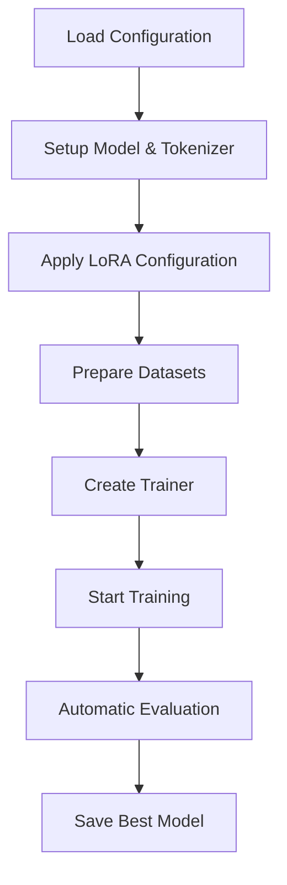

# Training Loop Implementation

This document details the training implementation for LoRA fine-tuning using the `transformers` and `peft` libraries, providing a simplified, high-level approach to medical AI model training.

## 🔄 Training Flow Overview

Our training pipeline uses HuggingFace's `Trainer` class, which handles the complex training loop internally. The process follows these key steps:



## 🚀 Main Training Pipeline

### Core Training Implementation

The main training function in `main.py` orchestrates the entire process:

```python
def run_training(cfg: SimpleConfig):
    """Simplified training pipeline using transformers."""
    logger.info("🚀 Starting training...")

    # Set environment
    os.environ["TOKENIZERS_PARALLELISM"] = "false"

    # Load and prepare data
    raw_dataset = load_and_prepare_data(cfg.data.train_file, cfg.data, cfg.seed)

    # Setup model with quantization
    model, tokenizer = setup_model(cfg.model.name, cfg.seed)
    model = setup_lora(model, cfg.lora)

    # Prepare datasets for training
    train_dataset, eval_dataset, test_dataset = prepare_datasets(
        raw_dataset, tokenizer, cfg.data
    )

    # Print GPU memory usage
    print_gpu_memory_usage()

    # Create and run trainer
    trainer = create_trainer(
        model, tokenizer, train_dataset, eval_dataset, cfg.output_dir, cfg.training
    )
    trainer.train()  # HuggingFace handles the entire training loop!

    # Evaluate and save
    test_results = trainer.evaluate(test_dataset)
    adapter_dir = save_model(model, tokenizer, cfg.output_dir, cfg.model.name)

    return adapter_dir
```

## 🛠 Key Components

### 1. Model Setup with Quantization

```python
def setup_model(model_name: str, seed: int):
    """Setup model and tokenizer with 4-bit quantization."""
    set_seed(seed)

    # 4-bit quantization for memory efficiency
    bnb_config = BitsAndBytesConfig(
        load_in_4bit=True,
        bnb_4bit_compute_dtype=torch.float16,
        bnb_4bit_use_double_quant=True,
        bnb_4bit_quant_type="nf4",
    )

    # Load model with quantization
    model = AutoModelForCausalLM.from_pretrained(
        model_name,
        device_map="auto",
        quantization_config=bnb_config,
        dtype=torch.float16,
    )

    # Load tokenizer
    tokenizer = AutoTokenizer.from_pretrained(model_name, use_fast=True)
    if tokenizer.pad_token is None:
        tokenizer.pad_token = tokenizer.eos_token

    return model, tokenizer
```

### 2. LoRA Configuration

```python
def setup_lora(model, cfg):
    """Apply LoRA configuration to quantized model."""
    # Prepare model for k-bit training
    model = prepare_model_for_kbit_training(model)
    model.config.use_cache = False

    # Create LoRA configuration
    peft_config = LoraConfig(
        r=cfg.r,                    # Low-rank dimension (16)
        lora_alpha=cfg.alpha,       # Scaling factor (32)
        target_modules=cfg.target_modules,  # [q_proj, v_proj, k_proj, o_proj]
        lora_dropout=cfg.dropout,   # Dropout (0.1)
        bias="none",
        task_type="CAUSAL_LM",
    )

    # Apply LoRA to model
    model = get_peft_model(model, peft_config)
    model.print_trainable_parameters()  # Shows only LoRA params are trainable

    return model
```

### 3. Dataset Preparation

```python
def prepare_datasets(raw_dataset, tokenizer, cfg):
    """Format and tokenize datasets using chat templates."""

    def format_example(example):
        # Use HuggingFace chat templates for proper formatting
        messages = [
            {"role": "system", "content": cfg.system_prompt},
            {"role": "user", "content": example["instruction"]},
            {"role": "assistant", "content": example["response"]},
        ]
        text = tokenizer.apply_chat_template(
            messages, tokenize=False, add_generation_prompt=False
        )
        return {"text": text}

    def tokenize_batch(batch):
        tokenized = tokenizer(
            batch["text"],
            max_length=cfg.max_length,
            truncation=True,
            padding="max_length",
            return_tensors="pt",
        )
        tokenized["labels"] = tokenized["input_ids"].clone()
        return tokenized

    # Apply formatting and tokenization
    formatted = raw_dataset.map(
        format_example, remove_columns=raw_dataset["train"].column_names
    )
    tokenized = formatted.map(
        tokenize_batch, batched=True, remove_columns=["text"]
    )

    return (
        tokenized["train"].with_format("torch"),
        tokenized["validation"].with_format("torch"),
        tokenized["test"].with_format("torch"),
    )
```

### 4. Trainer Creation

```python
def create_trainer(model, tokenizer, train_dataset, eval_dataset, output_dir, cfg):
    """Create HuggingFace Trainer with optimized settings."""

    training_args = TrainingArguments(
        output_dir=output_dir,
        max_steps=cfg.max_steps,  # Steps instead of epochs for better control
        per_device_train_batch_size=cfg.batch_size,
        gradient_accumulation_steps=cfg.gradient_accumulation_steps,
        learning_rate=cfg.learning_rate,

        # Evaluation and saving
        eval_strategy="steps",
        eval_steps=cfg.logging_steps,
        save_steps=cfg.logging_steps * 2,
        save_strategy="steps",
        save_total_limit=3,
        load_best_model_at_end=True,

        # Optimization
        warmup_ratio=0.03,
        lr_scheduler_type="cosine",
        weight_decay=0.01,

        # Memory optimization
        gradient_checkpointing=True,
        gradient_checkpointing_kwargs={"use_reentrant": False},

        # Logging
        logging_steps=cfg.logging_steps,
        report_to=None,  # Disable wandb/tensorboard
        remove_unused_columns=False,
    )

    trainer = Trainer(
        model=model,
        args=training_args,
        train_dataset=train_dataset,
        eval_dataset=eval_dataset,
        processing_class=tokenizer,
        data_collator=DataCollatorForLanguageModeling(tokenizer=tokenizer, mlm=False),
        callbacks=[
            EarlyStoppingCallback(early_stopping_patience=cfg.early_stopping_patience)
        ],
    )

    return trainer
```

## ⚙️ Configuration

### Training Configuration in `config.yaml`

```yaml
training:
  batch_size: 4
  gradient_accumulation_steps: 8
  learning_rate: 2e-4
  max_steps: 100
  logging_steps: 10
  early_stopping_patience: 3

lora:
  r: 16
  alpha: 32
  dropout: 0.1
  target_modules: [q_proj, v_proj, k_proj, o_proj]

model:
  name: microsoft/Phi-4-mini-instruct
  max_length: 512
```

### Simple Configuration Handling

```python
class SimpleTrainingConfig:
    """Simplified training configuration."""

    def __init__(self, cfg):
        self.batch_size = getattr(cfg, "batch_size", 4)
        self.learning_rate = float(getattr(cfg, "learning_rate", 2e-4))
        self.max_steps = getattr(cfg, "max_steps", 100)
        self.gradient_accumulation_steps = getattr(cfg, "gradient_accumulation_steps", 8)
        self.logging_steps = getattr(cfg, "logging_steps", 10)
        self.early_stopping_patience = getattr(cfg, "early_stopping_patience", 3)
```

## 📊 What the Trainer Does Automatically

The HuggingFace `Trainer` class handles all the complex training loop details:

- ✅ **Forward/backward passes**
- ✅ **Loss computation**
- ✅ **Gradient accumulation**
- ✅ **Optimizer steps**
- ✅ **Learning rate scheduling**
- ✅ **Gradient clipping**
- ✅ **Evaluation loops**
- ✅ **Model checkpointing**
- ✅ **Mixed precision training**
- ✅ **Distributed training support**

## 🔍 Training Monitoring

### Built-in Logging

```python
def print_gpu_memory_usage():
    """Print current GPU memory usage - called before/during training."""
    if torch.cuda.is_available():
        for i in range(torch.cuda.device_count()):
            allocated = torch.cuda.memory_allocated(i) / (1024**3)  # GB
            reserved = torch.cuda.memory_reserved(i) / (1024**3)    # GB
            total_memory = torch.cuda.get_device_properties(i).total_memory
            total = total_memory / (1024**3)  # GB

            logger.info(f"🖥️  GPU {i} ({torch.cuda.get_device_name(i)}):")
            logger.info(f"   📊 Memory: {allocated:.2f}GB allocated, "
                       f"{reserved:.2f}GB reserved, {total:.2f}GB total")
            logger.info(f"   💾 Free: {total - reserved:.2f}GB")
    else:
        logger.info("❌ No CUDA GPU available")
```

### Training Output Example

```text
🚀 Starting training...
📚 Loading dataset...
Train: 720, Val: 80, Test: 80
⚙️ Setting up model...
✅ Loaded microsoft/Phi-4-mini-instruct from cache
🔧 Configuring LoRA...
trainable params: 83,886,080 || all params: 14,888,534,016 || trainable%: 0.56%
🏃 Creating trainer...
📊 Trainer will run for up to 100 steps for fine-tuning model.

{'train_runtime': 45.67, 'train_samples_per_second': 63.45, 'train_steps_per_second': 2.19,
 'train_loss': 1.2345, 'epoch': 2.78}

📊 Evaluating on test dataset...
🎯 Test Results:
   eval_loss: 1.1876
   eval_samples_per_second: 156.78

💾 Saving model...
✅ Model saved to: ./checkpoints/model/my_custom_llm_Phi-4-mini-instruct
✅ Training complete!
```

## 🎯 Key Benefits of This Approach

1. **Simplicity**: No custom training loops to debug
2. **Robustness**: Battle-tested HuggingFace implementation
3. **Feature-rich**: Built-in evaluation, checkpointing, early stopping
4. **Memory efficient**: Automatic gradient checkpointing and mixed precision
5. **Scalable**: Easy to extend with callbacks and custom metrics

This streamlined approach leverages the power of modern ML libraries to focus on what matters: getting great results quickly and reliably.
